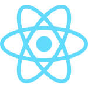
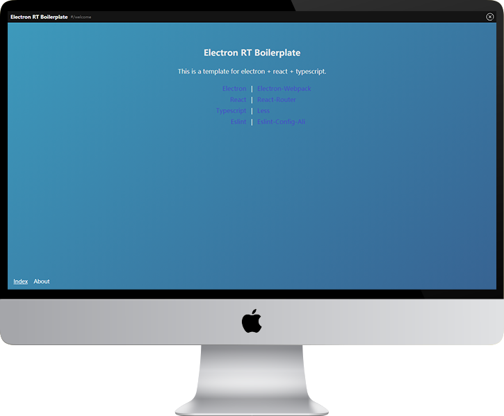

 

# Electron RT Boilerplate
> 一个开源的 Electron 开发环境脚手架，使用了 Electron + React + Typescript + Less + Webpack进行构建。  
> 代码检查使用了 Eslint ，规则集采用的是 eslint-config-ali ，强制删除不必要的分号。

## 界面预览



## 食用方法

### 克隆代码

```
git clone git@github.com:AlishaHawkward/electron-react-typescript.git
```

### 安装运行环境

```
// with npm installed
npm install

// or with yarn installed
yarn
```

### 运行调试
```
// with npm installed
npm run dev

// or with yarn installed
yarn dev
```

### 构建可执行文件
```
// with npm installed
npm run dist

// or with yarn installed
yarn dist
```

## 其他说明

#### 修改窗口标题
打开 `electron-webpack.json` 将 `Electron RT Boilerplate` 改为 `"You App Name"` 即可

#### 末尾强制以分号结尾（阿里规则）
删除 `.eslintrc.js` 中的下列代码即可
```
rules: {
  '@typescript-eslint/semi': [2, 'never']
},
```

#### 自定义 Webpack 设定
请参考[这个文档](https://webpack.electron.build/modifying-webpack-configurations)

#### 使用到的主要依赖

+ [Electron-Webpack](https://webpack.electron.build/)
+ [React](https://react.docschina.org/)
+ [Typescript](https://www.typescriptlang.org/)
+ [Less](http://lesscss.org/)
+ [Eslint](https://eslint.org/)

## 许可协议

[](https://app.fossa.com/api/projects/git%2Bgithub.com%2FAlishaHawkward%2Felectron-react-typescript.svg?type=large)